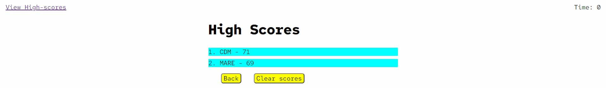

# code-quiz
## User Story

```
AS A coding boot camp student
I WANT to take a timed quiz on JavaScript fundamentals that stores high scores
SO THAT I can gauge my progress compared to my peers
```

## Acceptance Criteria

```
GIVEN I am taking a code quiz
WHEN I click the start button
THEN a timer starts and I am presented with a question
WHEN I answer a question
THEN I am presented with another question
WHEN I answer a question incorrectly
THEN time is subtracted from the clock
WHEN all questions are answered or the timer reaches 0
THEN the game is over
WHEN the game is over
THEN I can save my initials and my score
```

## Deployed app

### URL: https://kuiimaldonado.github.io/code-quiz/

You will be displayed with the main screen containing the instructions.


Click on the correct option. Below it will be displayed if the answer is correct or wrong.


When the quiz is finished you will be asked to submit your initials so you can save your score.


After submitting you will be displayed with the high scores ordered in descending order.


#### Special consideration!!
If the time reaches 0 the game will be finished inmediatly and will display the submit score screen.
